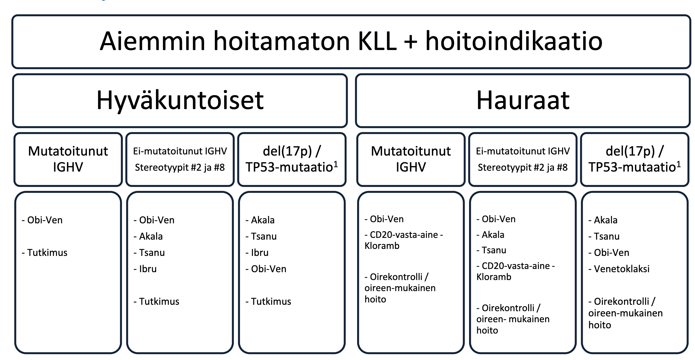

# Leukemia

## Akuutti leukemia

KLL leuk voi olla korkea -> pienet solut. AML jos leuk korkea, suuri määrä suuria soluja, voi tehdä tukoksia. = leukostaasi

Ei tarvitse eristää, mutta ei infektiopotilaiden kanssa samoihin tiloihin.

Leukostaasi verenvuodon riskitekijä -> nosta trombosyyttejä yli 30/50.

## hoito
Akuutti leukemia:

Akuutti promyelosyyttileukemia->ATRA-ATO -hoito. 

## Krooninen lymfosyyttileukemia

-keski-ikä diagnosoitaessa 70v. [^100]
-1/3 ei tarvitse mitään hoitoa.
-B-solut ekspressoi CD5, CD23 ja CD19
-Lymfosyytit yli 5, klonaalisia ja KLL fenotyyppiä, niin diagnoosin voi asettaa
-Oireetonta Binet A ja B –luokan tautia voidaan seurata.

Labra ennen hoitoja:
B-PVK-TKD, E-Retik, B-La, P-CRP, P-K, P-Na, P-Krea, P-Uraat, P-Gluk, P-ALAT, P-AFOS, P-Bil, P-LD, S-Ca-ion, E-ABORh, E-Coomb-O, S-B2Miglo, S-HIVAgAb, S-HBsAg, S-HBcAb,S-HCVA

Eli infektiota, joka voi puhjeta?

#### Hoito
Bruton tyrosin kinase inhibitor (BTKi) usein ensilinjaan.

[^1] SSLY 2026 lapin kokous - Pia Ettala
[^100]: 10.1001/jama.2023.1946