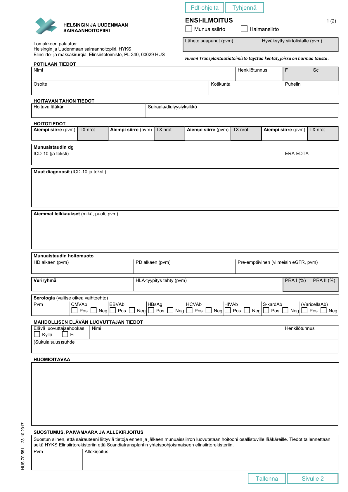
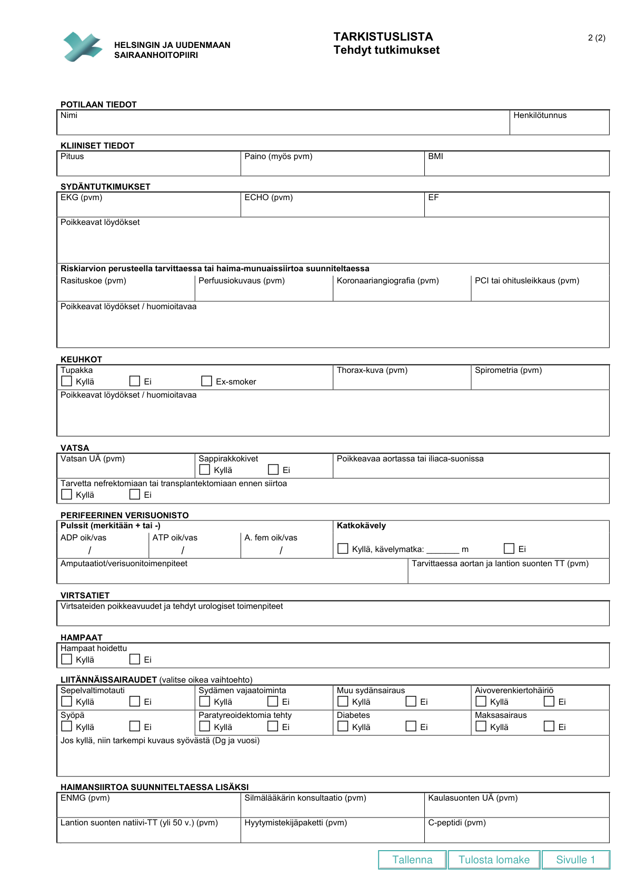

# Dialyysi

## lääkitys

-Spironolaktonin jatkamisesta rutiinisti ei hyötyä. [^100]

[^100]: Lancet: 10.1016/S0140-6736(25)01198-5 

## Munuaissiirre

### Ensi-ilmoitus munuaissiirtoon ja haimansiirtoon (HUS)

## Peritoneaalidialyysi

[ISPD Guidelines](https://ispd.org/guidelines)
