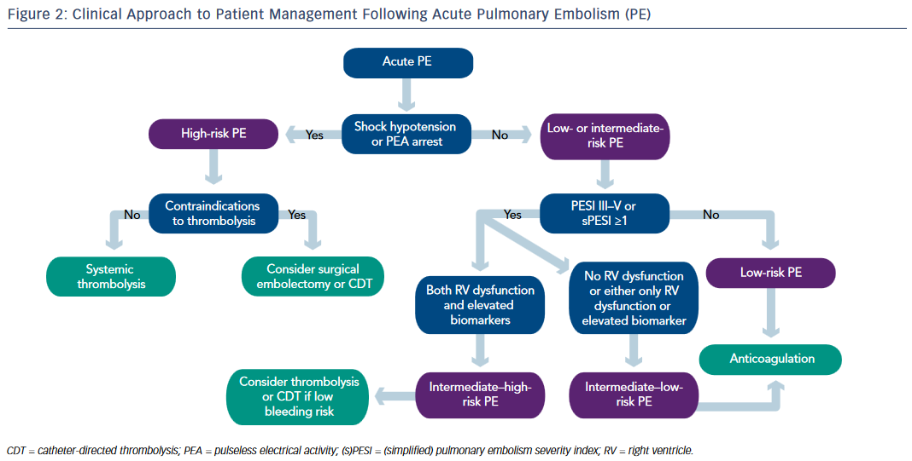

# keuhkoembolia 

## hoito
Noac, syöpäpotilailla lmwh

UÄ-fibrinolyysi voi olla hyödyksi, jos RV/LV>1, TnT koholla, ja vähintään kaksi näistä: (sys <110mmHg, p > 100, HF > 20, hypoksemia) [^100]

### alteplaasi
Alteplaasi 100mg korkeaan riskiin, 50mg voi harkita medium riskiin

[^101]

## tagit
Keuhkoveritulppa tulppa noac

[^100]: https://doi.org/10.1056/NEJMoa2516567
[^101]: https://doi.org/10.15420/usc.2016.10.1.30