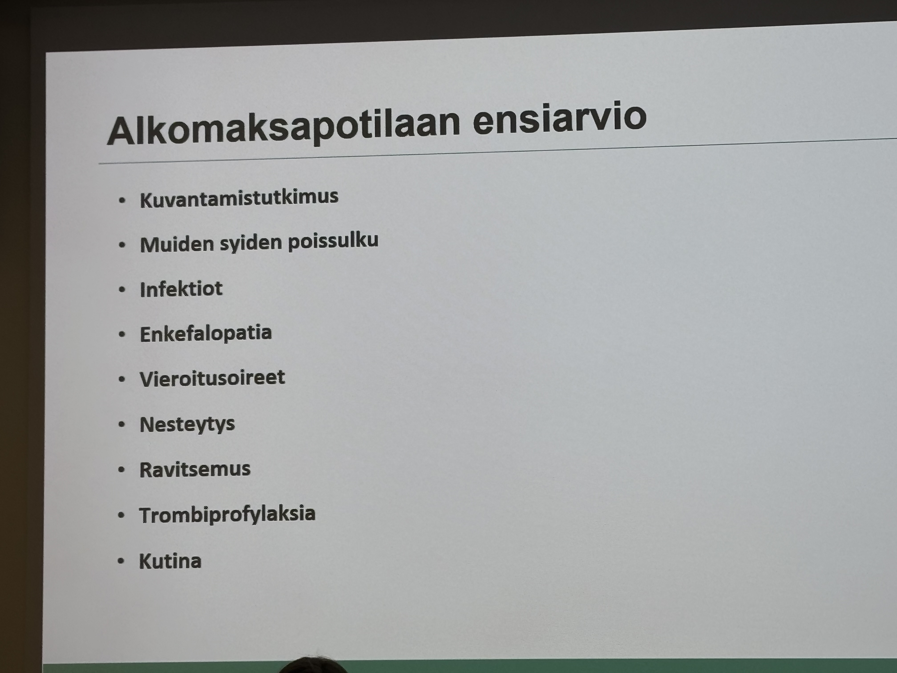

# maksa

## päivystyksessä

### paketit

Maksa 1 - krooninen
Maksa 2 - akuutti

[^1]

[^2]
HG nostaa 1. trimesterillä erityisesti -> ALAT 200.

[^1]: Eneli Katunin bilirubiiniesitys
[^2]: Maksa-arvot, SSLY 2026 lapin kokous. Ville Männistö UEF