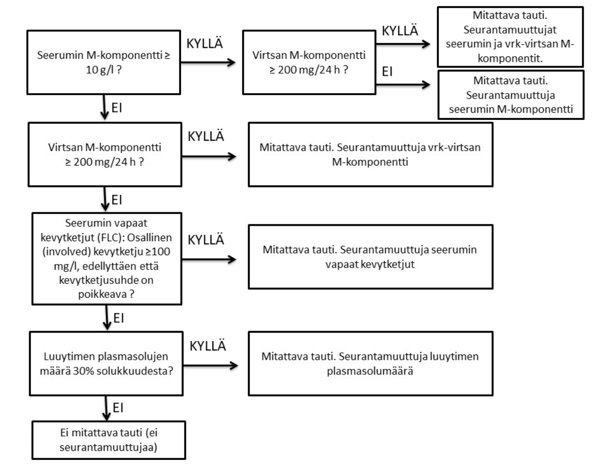

# Myelooma

### Diagnoosi

Labrat:
TVK, ABORhD, CRP, kalium, natrium, kreatiniini, albumiini, S-Ca, S-Ca-ion, fosfaatti, ALAT, AFOS, bilirubiini, uraatti, LD, beeta2mikroglobuliini, PLV, S- ja dU-proteiinifraktiot (elektroforeesit), S- ja dU- immunofiksaatiot, S-vapaat kevytketjut ja näiden suhde (S-IgLc-V), P-IgG, P-IgA, P-IgM. IgD myelooma tulee muistaa, niin voi ottaa sitten IgD-tasoja.

### hoito

