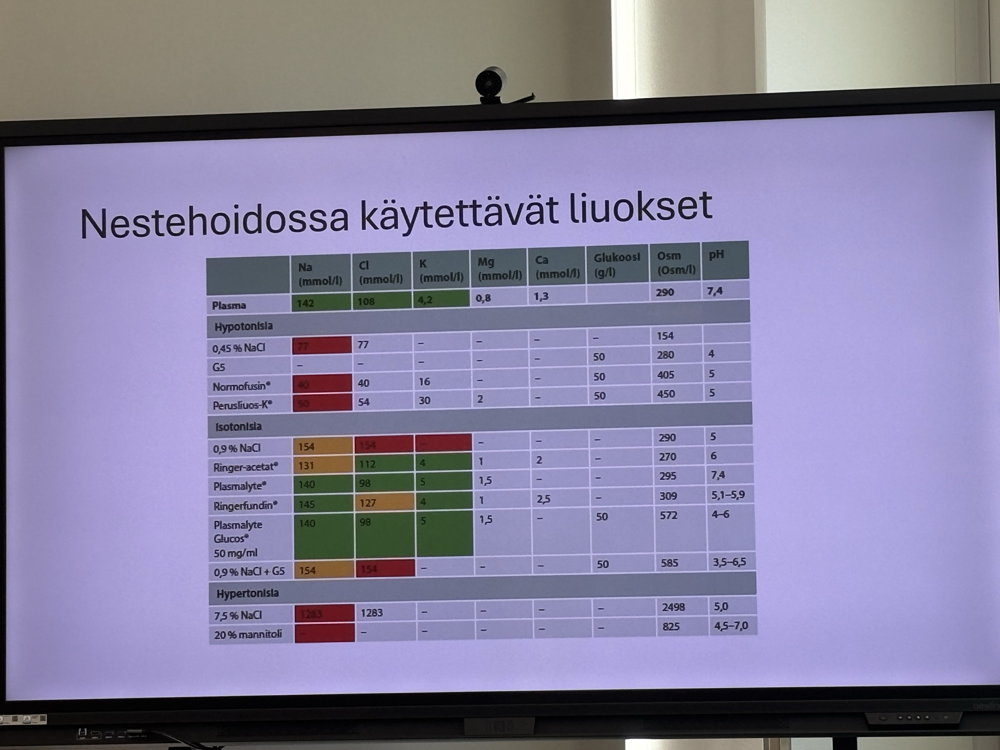
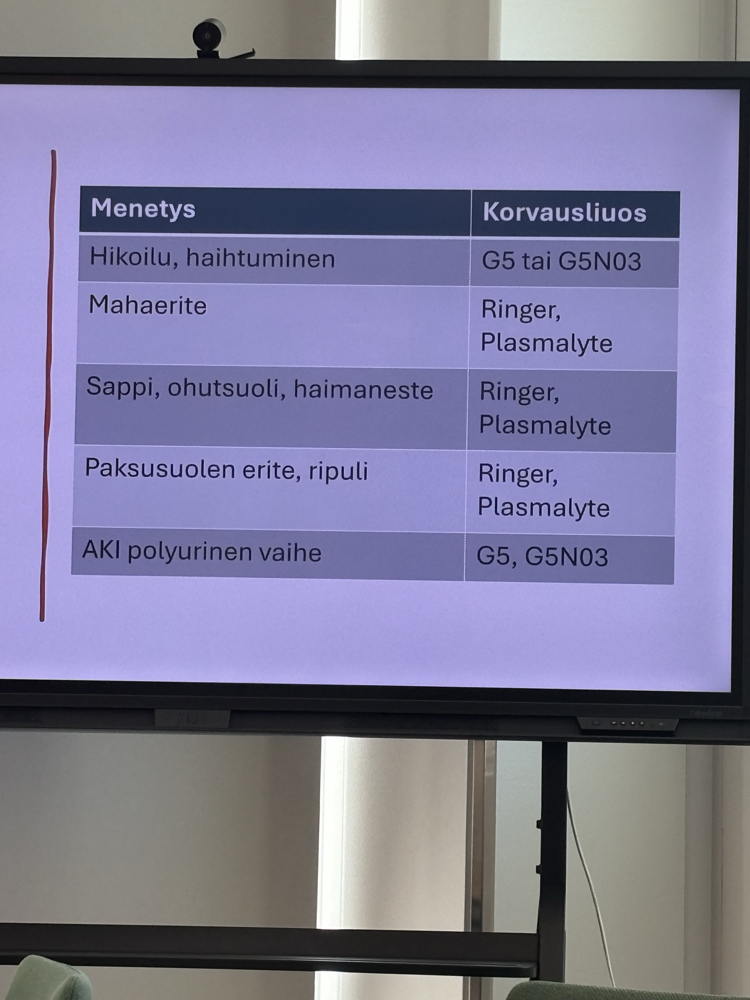
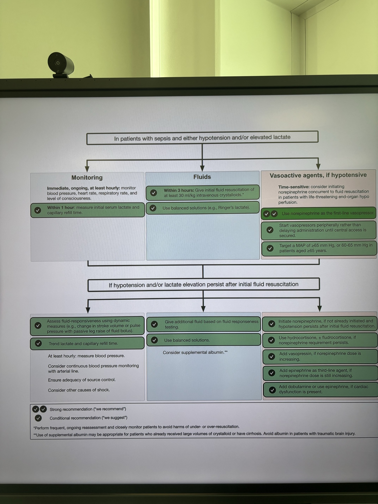

# Nestehoito ja ravitsemus
NRS-2002 seula, jos alle 3p, ei vajaaravitsemuksen riskiä. [^1]

Harris-Bendictin yhtälö kalorien arvioinnissa.

Loperamidilla voi hidastaa läpikulkuaikaa.
Teduglutidi, eli GLP2 analogi kasvattaa suolta.

[^1]: SSLY 2026 Lapin kokous Sampsa Pikkarainen

## Nestehoidossa käytettävät liuokset

[^2]

## Sepsis

[^2]

[^2]: el. Koivumäki - 26.5.2026