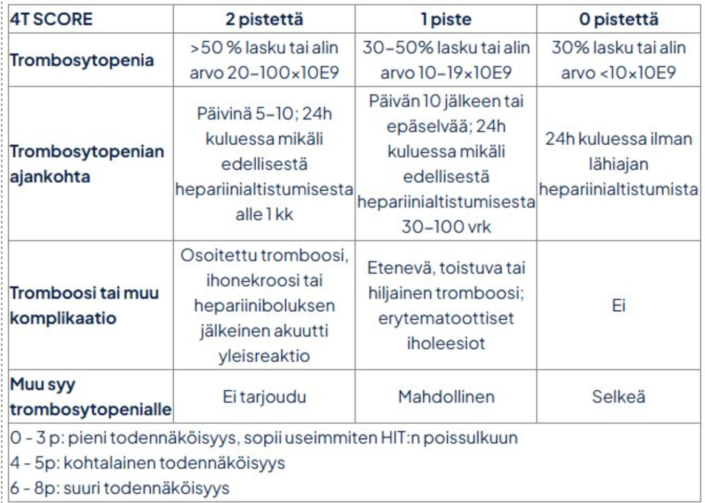
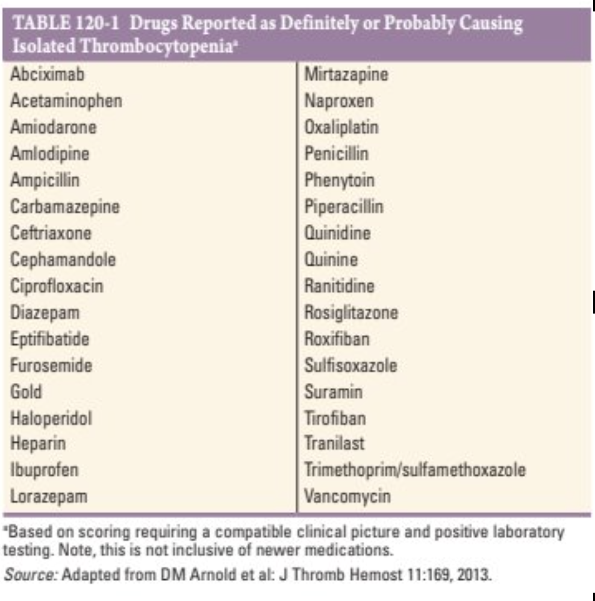

# Trombosytopenia

## Syyt

## ITP

## HIT

[^2]

## TTP
Tromboottisissa mikroangiopatioissa verisuonten seinämät hajottavat trombosyyttejä. Myös erytrosyytit ottavat osumaa -> skistiosyytit.

Yleensä ainoastaan trombosytopenia.[^1]

TTP potilaat ovat usein jotenkin "hönttejä", aivojen mikrotrombit tekevät tämän. ~Minna Lehto.

HUS:ssa tyypillisempää munuaisaffisio

TTP:ssä vWF:ää hajottava ADAMTS13 ei ole.

### Diagnoosi
Hemolyysi + (Haptog, retik, bil, LD), fragmentaatio + (B-Morfo).
ADAMTS13 aktiivisuus 20695 P –ADAM13​
Komplementtitutkimuksella erotetaan HUS 6639 S -C-Def​
Coombs yleensä -.

## Lääketrombosytopenia

Romiplotim (TPO agonisti) vähentää huomattavasti oksaaliplatiiniin liittyvää trombosytopeniaa. [^100]

[^1]: https://hematology.fi/hoito-ohjeet/hoito-ohje-1-2/husn-suosituksia/tromboottinen-trombosytopeeninen-purppura-ttp/

[^2]: fimlab

[^100]: 10.1056/NEJMoa2511882